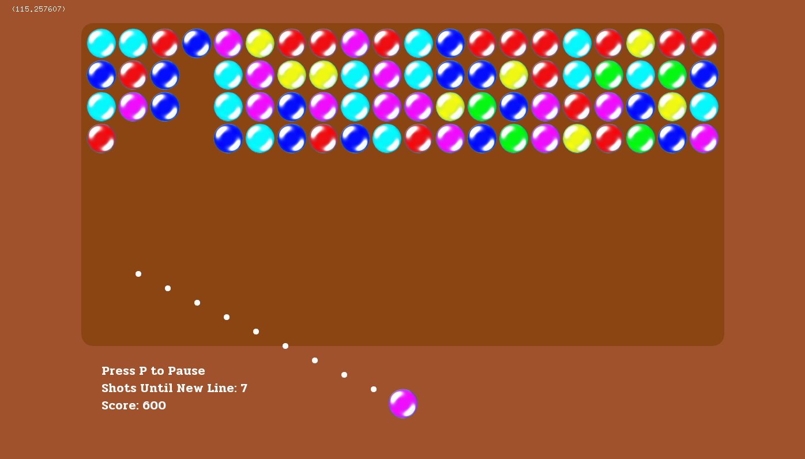

# Ball Game

Note: Built using CMake, should install openFrameworks automatically.

# What is this?

This is a game made using C++ and openFrameworks. It was the first app I ever built using C++ made back in December of 2021. I made it to learn the basics of C++ for a university class.

I have since made it a CMake project for easier building and distribution. Thanks to https://github.com/HerrNamenlos123 for adding CMake support.

Don't expect much from this game, it's just a simple game and I got a lot wrong. Don't mind the comments. I'm not sure if I'll ever come back to this project, but I might. The poor code bothers me.
